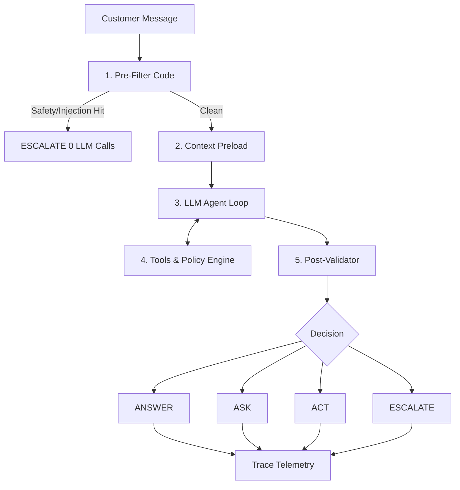

# Sentinel-Governor Architecture

## Overview

The Sentinel-Governor architecture enforces the Propose-Verify-Commit pattern:
- **AI reasons**: Generates proposed actions via native tool-calling.
- **Backend verifies**: Deterministic code checks ownership, timestamps, and policy constraints.
- **Database stores truth**: Order status and transactions remain isolated from model hallucination.
- **Tools perform actions**: Dedicated envelope-wrapped functions execute operations.
- **Humans handle exceptions**: Escalation paths for safety, ambiguity, and high thresholds.

## Flowchart

