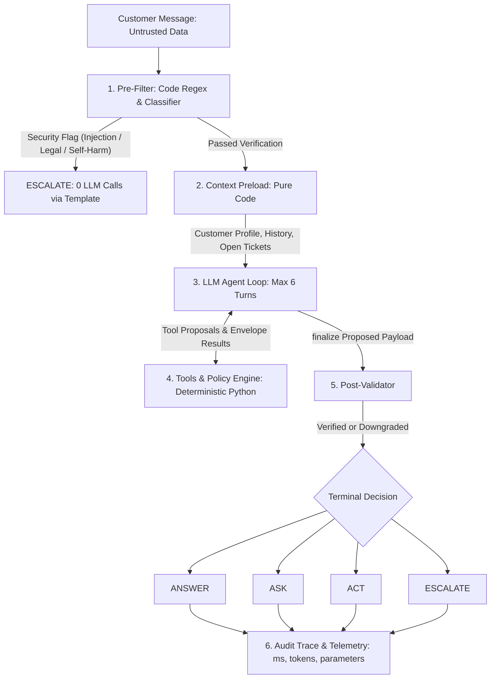

# Sentinel-Governor System Architecture

The Sentinel-Governor architecture enforces the **Propose-Verify-Commit** paradigm: the language model only proposes actions and messages, while deterministic Python backend code verifies every monetary value, ownership relationship, return window, and policy constraint before committing any action to the database.

---

## Architecture Flowchart



---

## Layer-by-Layer Specifications

### 1. Pre-Filter Guardrails (Zero-LLM Fast Path)
- **Engine**: Pure Python regex patterns supplemented by a tiny token-capped classifier for ambiguous prompts > 40 characters.
- **Trigger Conditions**:
  - Prompt injection indicators (`ignore previous instructions`, `reveal system prompt`, `developer mode`, `<system>`).
  - Legal threats and attorney representations (`sue`, `lawsuit`, `lawyer`, `court notice`, `consumer forum`).
  - Safety and regulatory red lines (harassment, threats, self-harm language).
- **Execution Guarantee**: When triggered, `run_turn()` short-circuits instantly with **0 LLM calls**, calls `escalate_to_human()` with `priority="high"`, and returns a compassionate, fixed-template response (decision: `ESCALATE`).

### 2. Context Preload
- **Mechanism**: Executed in Python prior to invoking the model loop. Preloads:
  - Customer record (name, contact information, loyalty tier).
  - Stored conversation history (recent multi-turn dialogue context).
  - Open support tickets and pending escalation states.
- **Benefit**: Eliminates redundant tool invocations for basic account lookups, cutting token usage and reducing turn latency by 150–300ms.

### 3. LLM Agent Reasoning Loop
- **Model Orchestration**: Provider-agnostic client calling the active model (`claude-3-5-sonnet-20241022` or compatible OpenAI/Anthropic spec) with native tool definitions.
- **Safety Boundaries**:
  - Fixed loop cap: `max_iterations = 6`. If the model exceeds 6 iterations without finalizing, the loop aborts and triggers `ESCALATE` with an automated support ticket.
  - Read tools memoization: Read-only queries with identical parameters (`get_order`, `get_customer`) within the same turn are cached in memory to eliminate duplicate latency.
  - Termination: Terminates strictly when the model calls the synthetic schema function `finalize(decision, intents, reply, internal_reasoning, risk_flags)`.

### 4. Tools & Policy Engine (Truth Layer)
- **Envelope Standard**: All tools adhere to an exception-free envelope pattern:
  ```python
  {"ok": bool, "data": Any, "error": Optional[str]}
  ```
  Tools never raise unhandled exceptions; operational errors (e.g., `ownership_mismatch`, `order_not_found`, `window_expired`) are cleanly returned as structured data.
- **Ownership Verification**: Order tools take `customer_id` from the active authenticated session. If the requested order belongs to a different customer, the tool returns `{"ok": False, "error": "ownership_mismatch"}` and leaks zero metadata.
- **Deterministic Policy Math**:
  - `effective_window(policy, loyalty_tier)` = `base_days + loyalty_extension`
  - `restocking_fee(policy, category, value, reason)` = 0 for damaged/defective items; configured percentage for buyer's remorse.
  - `max_refund(requested, order_value, fee)` = `min(requested, order_value - fee)`.
  - Amounts are recomputed in Python code; customer-supplied numbers are treated strictly as untrusted requests.

### 5. Post-Validator
- **Enforcement Principle**: The post-validator can only **downgrade** decisions (`ACT` $\rightarrow$ `ASK` or `ESCALATE`); it can never elevate a decision to `ACT`.
- **Validation Rules**:
  - Prevents automated refunds on OTP-verified deliveries if the customer claims non-receipt $\rightarrow$ downgrades to `ESCALATE`.
  - Ensures monetary amounts in `reply` match the committed refund values from tool logs.
  - Leak Scrubbing: Regex strips sensitive fields (delivery driver phone numbers, GPS coordinates, internal OTP secrets) from assistant text.

### 6. Audit Trace & Telemetry
- Every turn records an ordered sequence of `TraceStep` events:
  - Step index and tool name.
  - Sanitized argument payload.
  - Short execution summary.
  - Wall-clock latency (`ms`).
  - Token consumption (`tokens`).
- Exposes complete auditability in the UI trace panel and exports telemetry metrics to evaluation reports.
